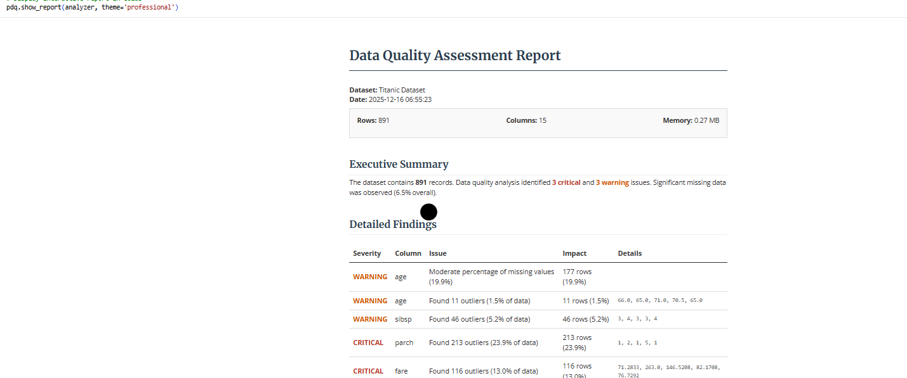

# PyDataQuality

**The Enterprise-Grade Data Quality Engine for Python.**

PyDataQuality automates the tedious 80% of data science: validating, profiling, and cleaning new datasets. It transforms raw pandas DataFrames into publication-ready quality reports with a single line of code. Designed for high-velocity data teams, it features batch processing for big data, custom rule validation, and AI-powered remediation suggestions.



## Features

### Core Capabilities
- ✅ **Data Quality Analysis**: Detect missing values, outliers, inconsistencies, and data type issues
- ✅ **Data Extraction**: Pinpoint and extract problematic rows (e.g., specific outliers) for remediation via `get_problematic_rows()`
- ✅ **Multi-Format Support**: Native support for CSV, Excel (.xlsx, .xls), JSON, and Parquet files
- ✅ **CLI Interface**: Auto-detects file formats from the terminal - no coding required
- ✅ **Interactive Notebook Display**: Direct rendering in Jupyter/Colab with `show_report()`
- ✅ **Batch Sampling**: Process large datasets (GBs) efficiently with chunk-based sampling
- ✅ **Custom YAML Rules**: Enterprise-grade validation with configuration files
- ✅ **AI Remediation Prompts**: Auto-generated Python scripts for fixing detected issues
- ✅ **Comprehensive Visualizations**: Publication-quality plots for data quality assessment
- ✅ **Professional Reports**: HTML, text, and JSON reports with actionable insights
- ✅ **Easy Integration**: Works seamlessly with pandas DataFrames from any source

### Supported Input Formats
**CLI**: Auto-detects CSV, Excel (.xlsx, .xls), JSON, Parquet  
**Python API**: Accepts any pandas DataFrame from:
- CSV files (`pd.read_csv()`)
- Excel files (`pd.read_excel()`)
- JSON files (`pd.read_json()`)
- Parquet files (`pd.read_parquet()`)
- SQL databases (`pd.read_sql()`)
- APIs (any source that produces a DataFrame)
- Cloud platforms (Snowflake, BigQuery, etc.)

**Summary**: PyDataQuality works with CSV, Excel, JSON, Parquet files, and any pandas DataFrame from SQL databases, APIs, or cloud platforms. The library is format-agnostic - it only requires a pandas DataFrame as input.

## Installation

```bash
# Clone the repository
git clone https://github.com/DominionAkinrotimi/pydataquality.git
cd pydataquality

# Install in development mode
pip install -e .

# Or install requirements directly
pip install -r requirements.txt
```

## Quick Start

```python
import pandas as pd
import pydataquality as pdq

# Load your data
df = pd.read_csv('your_data.csv')

# Quick quality check
summary = pdq.quick_quality_check(df, name="My Dataset")

# Comprehensive analysis
analyzer = pdq.analyze_dataframe(df, name="My Dataset")

# Generate visualizations
visualizer = pdq.create_visual_report(analyzer)

# Generate HTML report
pdq.generate_report(analyzer, output_path="quality_report.html", format='html')
```

## Documentation

- [Quickstart Guide](docs/quickstart.md)
- [API Reference](docs/api.md)
- [Examples](examples/)

## Examples

Check the `examples` directory for comprehensive usage examples:

1. **Basic Usage**: Simple analysis and reporting
2. **Advanced Features**: Custom configurations and visualizations
3. **Real-world Scenarios**: Handling various data quality issues

## Project Structure

```
pydataquality/
├── analyzer.py          # Core analysis engine
├── visualizer.py        # Data visualization module
├── reporter.py          # Report generation
├── utils.py            # Utility functions
├── config.py           # Configuration settings
├── __init__.py         # Package exports
├── examples/           # Usage examples
├── tests/              # Unit tests
└── docs/              # Documentation
```

## Key Components

### 1. DataQualityAnalyzer
Core analysis engine that examines data structure, detects issues, and computes statistics.

### 2. DataQualityVisualizer
Creates comprehensive visualizations including:
- Missing value heatmaps
- Outlier detection plots
- Distribution analysis
- Correlation heatmaps
- Categorical value distributions

### 3. QualityReportGenerator
Generates professional reports in multiple formats with actionable recommendations.

## Contributing

Contributions are welcome! Please feel free to submit a Pull Request.

1. Fork the repository
2. Create your feature branch (`git checkout -b feature/AmazingFeature`)
3. Commit your changes (`git commit -m 'Add some AmazingFeature'`)
4. Push to the branch (`git push origin feature/AmazingFeature`)
5. Open a Pull Request

## License

This project is licensed under the MIT License - see the [LICENSE](LICENSE) file for details.

## Acknowledgments

- Built with pandas, matplotlib, and seaborn
- Inspired by real-world data quality challenges

- Designed for data scientists and analysts

